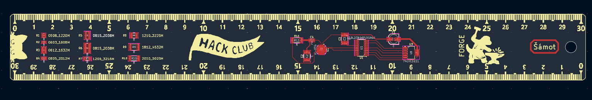
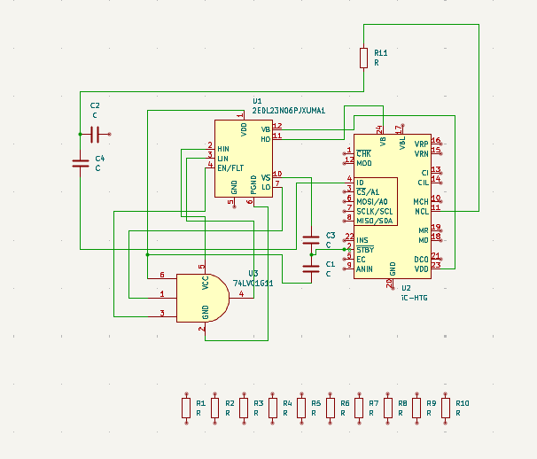
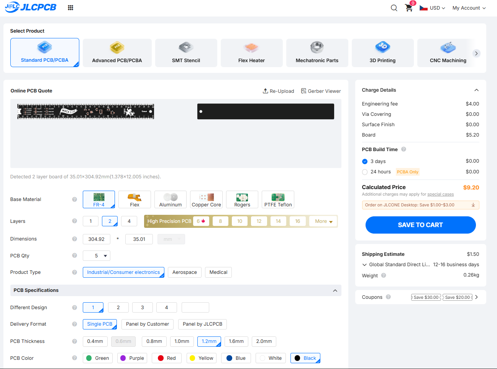
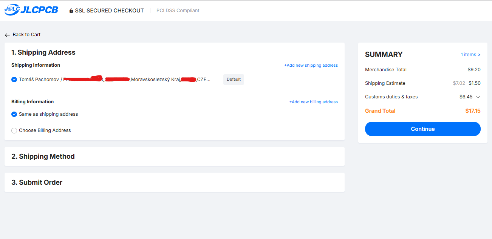

## 30 cm PCB Ruler
https://FORGE.hackclub.com/projects/1713

Why:
- Is is cool, the schooll is coming :O and i dont have a ruler :)

Schematic is randomly connected so it looks good on PCB (not supposed to work :D):

This is a Ruler made as PCB in KiCAD and InkScape(for .svg editing).

- Every design file is in /images folder. 
- And anyone can modify the PCB Ruler by opening This KiCad project in KiCAD v10+
- For direct manufacturing, the gerber files .zip is in /gerbers folder
- Cost around 10 US Dollars :)

Here is JLCPCB cart:

Rendered Image:

## BOM:

| What                             | PRICE    |
| -------------------------------- | -------- |
| PCB (Ruler) + shipping + Customs | 17.15 USD |

*note: I dont need components since I will not solder them on the ruler. The components footprints are for <u>design</u>*

## Builded  project:

Detailed photos:

The precision is great, at the end it has offest just by 0.5mm which is great

