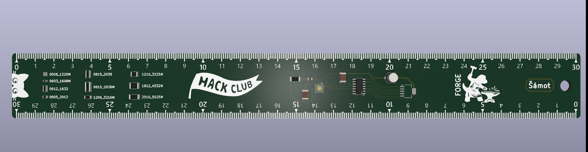

## 30 cm PCB Ruler

https://FORGE.hackclub.com/projects/1713

This is a Ruler made as PCB in KiCAD and InkScape(for .svg editing).

- Every design file is in /images folder. 
- And anyone can modify the PCB Ruler by opening This KiCad project in KiCAD v10+
- For direct manufacturing, the gerber files .zip is in /gerbers folder
- Cost around 10 US Dollars :)

Here is JLCPCB cart:

Rendered Image:

